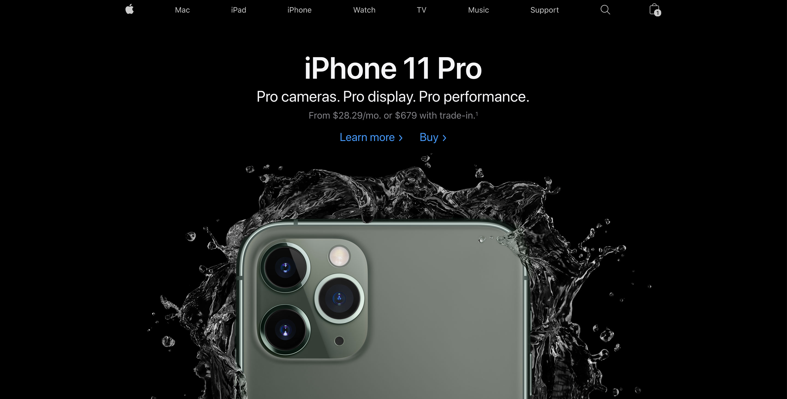
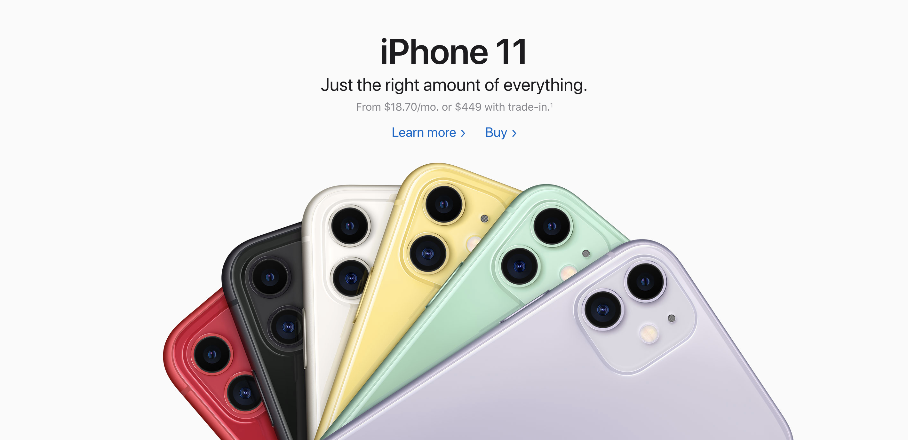
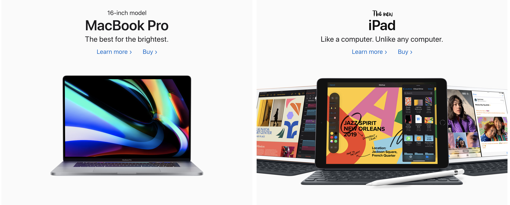
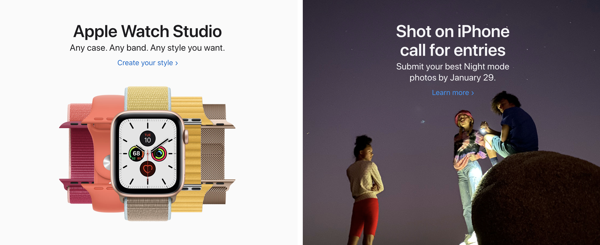

## Intro

The main aim of this rhetorical analysis is to identify and explain certain rhetorical concepts used by the digital creators of the [Apple's website](https://www.apple.com/). This analysis will mainly focus on the rhetorical situation, modes and design elements used throughout the website. We will also try to draw parallels between multimodal and traditional rhetoric to see how they are connected and used together to establish effective communication with a reader.

## Modes

Let us firstly focus on the individual modes because identifying them will help us show that the website is indeed a multimodal resource. Figure 1 shows us the main page of the website and just by looking at it, we can immediately identify a few modes used. The first and most common one is a **linguistic mode**. We can note the word choice on Apple’s website is very accurate and concise. They try to avoid extra text and turn everything you have to know into one short sentence. That’s a distinctive feature of Apple: the *minimalism* is one of the key concepts in all of their products. For example, consider the following sentence which is also the first one user sees when visiting the website:

> **_Pro cameras. Pro display. Pro performance._**

Figure 1. Initial look at Apple's website

There are no difficult technical words, there are just simple and concise phrases that everyone can understand and they indeed describe iPhone’s main features.

The next mode used on the website is the **visual mode**. It refers to images, fonts, layout and colours used on the website. All these things are also based on _minimalism_. Figures 2 and 3 demonstrate the main part of the website. As you can notice, it is monotone in terms of colour because Apple uses its few brand colours to create their products. These are black, white and very bright colours. The way elements are **framed** on the website is also very accurate. It is very easy to see separate blocks of information and almost each of them has a heading, description and a supporting picture. This makes the process of consuming information very easy and accessible to everyone.

Figure 2. iPhone 11 Ad

Figure 3. MacBook and iPad Ad

Even though someone can miss this part but the website also uses **gestural mode** which is mostly about body language. Have a look at figure 4. Pay attention to the way people stand on the ground and what happens around them. Even their body language is precise. Look at their eyes. They have a very piercing gaze. There is nothing around them and it makes users feel the easiness that comes from Apple’s products. 

Figure 4. Apple Watch and Shot on iPhone

## Rhetorical situation

While analyzing the multimodal resource, it is essential to identify its **intended audience**, **purpose** and **context** in which it was created. 

In the case of Apple’s website, it is not that hard to identify who is the audience. Here it is the people who are interested in the products of Apple and probably for those who want to buy or at least have a look at them. This can be concluded because of the showcase of products on the website including their appearance, price and characteristics like colour, display, etc. The icon of the shopping cart in the top right corner also shows that the website’s audience is potential buyers of Apple’s products.

When we have identified the intended audience, there is no problem to identify the purpose of the resource. Since the main visitors of the website are potential buyers, the purpose is to advertise and make everything possible to show that Apple’s products are the best ones on a market. This is done by showing the pictures and highlighting the best and new features of the new iPhone, Apple Watch, AirPods, etc. There is also a lot of “Buy”, “Learn more” buttons out there which proves the fact that the purpose is to advertise and make people want to buy Apple’s products.

In terms of context, the website’s **medium** is a Web. This choice is not random. Did you ever see ad booklets by Apple? I guess no. Apple uses the advantages of web to spread the word about its products. At nowadays, Web is very accessible and affordable. All you have to do is to type the address of the website into your search bar and that’s it. The website was lastly updated on 13th September, 2019 when the iPhone 11 was released. From this fact we can conclude that website changes regularly because Apple releases new products very often. For example, have a look at this [article](https://www.businessinsider.com/apple-website-2012-9). It shows how the website has changed since 1996. A lot of things changed since and that’s because of technological development the world experiences. We can also note that the website is both accessible and looks great on desktop and mobile devices. This is called responsive design. 

## Basic design elements

A lot of things regarding the design was already mentioned in the modes section of the analysis. However, there are still things to note. 

The simple **organization** of things on the website is also called as flat design and this type of design is very trendy nowadays. Things look very organized and any user can separate the page into the main blocks: header with the navigation bar, iPhone 11 Pro block, secondary products block and then the footer ends the page. This actually is the basic structure of any website: header, main part and footer. Note that the starting block with iPhone is empty by ~70%. This is the feature of flat and minimalistic designs that are common to Apple stylings.

It would also be true to say that elements on the webpage are grouped in close **proximity**. For example, have a look at Figure 3 again. Each product’s block consists of small elements which are really close to each other. That makes the user understand that this block is a separate piece of information which is independent of other website’s parts. This creates a feeling of easiness for users and allows them to efficiently consume information without difficulties in understanding what belongs to what. 

Designers of Apple’s website have also paid attention to the **emphasis** of certain elements. Each block has a bold header which indicates the importance of the information. In most of the cases, the names of the products are bold. This is strongly connected to the purpose of the website: to advertise products of Apple. Making them bold means emphasizing attention on them and therefore, increasing the chance these products are bought by visitors.

## Connection with traditional rhetoric

I believe that Apple’s designers try to touch the soul of users and that’s why the website is mostly connected to **pathos** because it appeals to emotions. The feeling of easiness and prestige make people fall in love with products of Apple and that’s because designers effectively affect the emotions of people by creating a flat, precise and minimalistic design. I have not much to say about logos and ethos. Probably, it is worth noting that the footer on the website contains links to the privacy policy, terms of use and other important documents which could be assigned to ethos because they are directly connected to credibility and showing that this website is indeed an official website of the Apple, Inc.

## Final thoughts

I sincerely believe that everyone one the web should learn how to create websites looking at the design of Apple. They perfectly use design elements and rhetoric modes to effectively communicate with a reader and influence their intended audience. The way they place and align information on their website is concise and let people easily navigate through the website. It is also worth nothing that they keep balance between socially bonding and formal languages. I am not ready to say to which group they exactly belong because they use best out of two types of languages. Their word choice is informal enough so the audience can understand it and at the same time, they feel formal in terms of content, information and the overall purpose of the text.