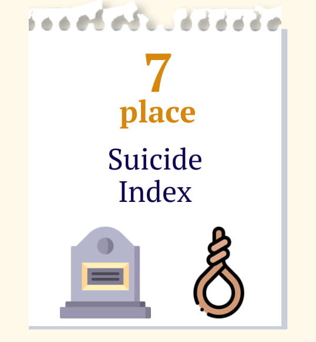
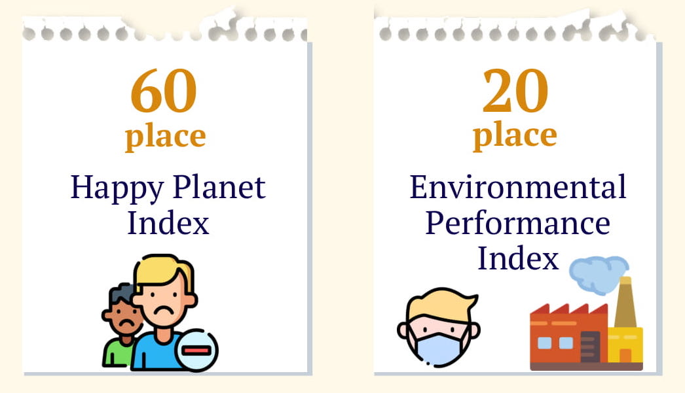

## Intro

Today I am going to analyze the infographic created by my admirable group mate Shahizada with whom I am currently taking my SHSS240 class. 

Please visit this [link](https://www.ironsoul.me/p2p.pdf) to have a look at the work. Try to analyze it on your own before reading my analysis.

The design shows viewers which places Kazakhstan take according to 6 different measurement indices. By the first look, the design is very clear, understandable and has a high quality. In order to analyze it further, I am going to look at some Universal Principles of Design which we have covered in our classes. Besides suggesting improvements and noting good parts, I will try to draw connections between a certain principle and **iconography**, **form** and **semiotics**. If you are not familiar with these terms, please read my [previous blog](https://www.ironsoul.me/savage) where I explain each of the terms in detail.

In my humble opinion, there are some principles on which I can give some advice to my classmate. These are **framing**, **proximity** and **alignment**. Let’s now iterate through each of them and see how well today’s infographic match them.

## Framing

Let me firstly state the definition of framing so you have a basic understanding of what it is.

> _**Framing** is a technique that influences decision making and judgment by manipulating the way information is presented._

If you are familiar with form and iconography, framing is actually all about **form**. This is _“the manner”_ in which information is presented. Here we touch on things like the use of images, words and overall context to manipulate the audience.

Regarding the work of Shahizada, I believe that her work lacks emphasizing what she tries to say. Does the work emphasize positive or negative? Maybe it takes a neutral part but the phrase _“Think about the future of our country”_ does not let me think this way. In my opinion, this phrase drastically affects how the audience derives meaning from the infographic. However, this phrase is not supported by any image or another text stating for example that there is something bad with our country and we should think about it. 

Information about Kazakhstan taking places in some of the indices seems as just informational thing but not something that will make us think about future our country. I would recommend to get rid of the phrase in the end or add some more negative entourage to some of the boxes. 

For example, use some dark colour to emphasize that Kazakhstan takes 7th place in suicide index and that would really make people think about the future of our country. Look at figure 1, currently, this box looks like this and it does not show that this is a thing to be cared about.

Figure 1. Kazakhstan's suicide rate

In short, there is a lack of **signifiers** in the work which has a _“think about our country”_ appeal as a **signified**. The possible cure might be to add more icons, symbols and indices making us think about the future of Kazakhstan.

## Proximity 

> _Elements that are close together are perceived to be more related than elements that are farther apart._

In the case of Shahizada’s work, there is clear and nice proximity between cards with Kazakhstan’s places. The audience immediately can see the relatedness between them and it definitely makes the overall design easier. 

However, I still would suggest increasing the distance between cards block, header and footer. Currently, all rows have almost the identical distance between them but it would be better to separate the blocks with different information so they exist by their own. By looking at figure 2, you can see these 3 blocks. 

Figure 2. The infographic with blocks highlighted

## Alignment

> _The placement of elements such that edges line up along common rows or columns, or their bodies along a common centre._

Elements on the work are aligned centrally and basically, it does not use any other alignment. This is great because it makes the infographic very easy and understandable but probably it would be better to add some additional alignment to make the infographic more interesting.

What I would really suggest improving is to use the bigger distance between icons and text in cards. Probably it would be even better to increase the height of the cards so the information in them is not _“compressed”_. This would also fill the empty space in the infographic. For example, have a look at figure 3. Cards displayed on this figure have a problem with theirs icon being stuck to the bottom of the card. How about adding some padding to it?

Figure 3. Cards having problem with alignment

## Final thoughts

Overall, Shahizada did a great job and her work is quite simple and understandable. Fortunately or maybe not, there is no really complex iconography, form and semiotics used. There are some icons which have a physical resemblance to the signified but there are no symbols and indices that could create some deeper meaning. Probably, adding them as I was suggesting in the framing part would make the message of Shahizada more clear.

I really hope my analysis made sense and it would be useful for Shahizada to make her work even more exciting.

