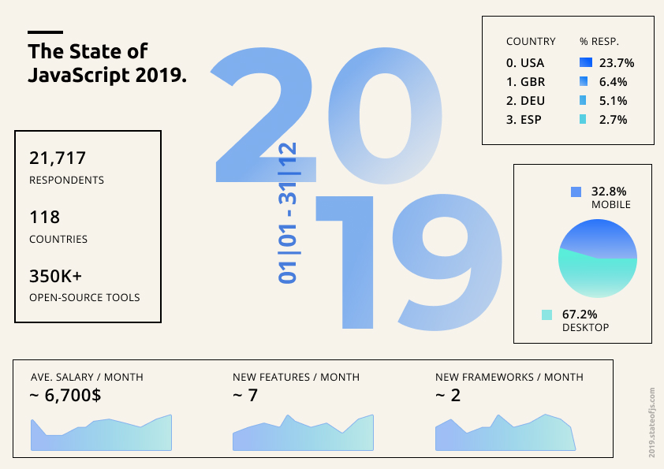
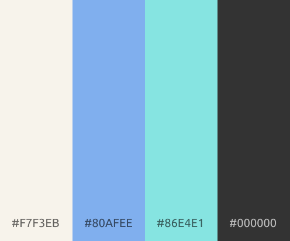
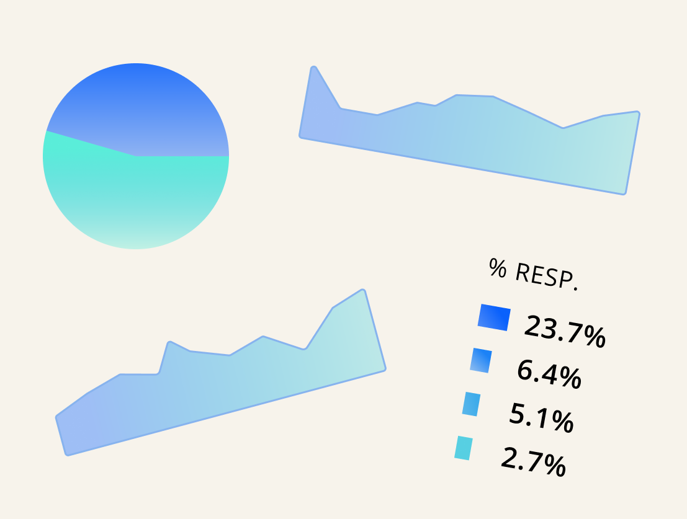

## Intro

After reading the [peer’s review](https://shahizadamashrapov5.wixsite.com/thefuture/post/how-to-determine-a-successful-multimodal-project) of [my infographics](https://www.ironsoul.me/infographics.pdf) and fixing noted issues, I am now ready to share with you what kind of design methods I used to create my work. It really required me a lot of time to make sure that I have followed all the guidelines according to universal principles of design.

Before diving into design, I think it is important to mention what is a topic of the infographics. The work shows the results of the [survey](https://2019.stateofjs.com/) held by Sacha Grief and illustrates how JavaScript has changed through 2019. It touches upon things like a change of average salary, the number of new JavaScript features, mobile/desktop usage of JavaScript, etc.

There are 100 principles of design and I hand-picked only few of them that in my opinion are most important and could be noted in my creation. The following is a sorted list of them starting from the most important one: **chunking**, **color** and **comparison**. After considering the principles, I will try to explain how they are connected to iconography, form and semiotics to effectively influence my audience.

## Chunking 

Chunking helps us to make the process of understanding of information easier by combining several **related units** of information into groups or _“chunks”_. This concept is closely related to the way the human brain works because it assumes that we can easily process only a few numbers of information chunks. Usually, the effective number of chunks varies from 3 to 5. 

By looking at figure 1, you can note what kind of chunks my work consists of. There are 4 main informational chunks and each of them holds a different kind of information in it. One of them is purely text-written, while others include charts and graphs. I have also tried to give them different shapes in order to make it clear for each element to which chunk it belongs. 

Figure 1. Chunks on the infographics

## Color

Picking colors is very important because it is basically the first thing that can **attract attention** and **enhance aesthetics** in your work. Similarly to chunking, it is recommended to use around 5 colors in your work again because of the ability of our eye to process information. 

In my case, there are 4 different colors used and other tints were created just by changing the opacity of 4 base colors. Please refer to figure 2 to see the color palette used in my infographics.

Figure 2. Color palette

It was also important to pick colors which play nicely with each other. For this purpose, I would recommend using services such as [colorsinpro.com](https://colorsinspo.com/) which suggests suitable pair color for the color you provide. In my work, I have picked soft colors and mostly used dark font color on the bright background which is right in terms of color choices. 

## Comparison

Since I have chosen to illustrate the results of the survey, it was essential to focus on **illustrating relationships** and **patterns** between different **system variables**. In simple words, I was required to nicely choose how to show, for example, the difference between the usage of JavaScript on mobile/desktop, etc.

By looking at figure 3, you can note what kind of techniques I have used to illustrate relationships between different things. My toolset includes pie charts, graphs and histograms. By using them, I made sure that my audience can easily see the difference between concepts I am comparing in each of the blocks. 

Figure 3. Comparison tools

## Iconography, form and semiotics

In the end, all principles of design are created to make sure that we nicely choose _“what is being shown”_, _“the manner”_ in which information is shown and signs that help our audience derive meanings from our works. 

In the case of my infographics, I made everything possible to make people easily understand what I am trying to say. I have used color to improve my form and iconography, so people **enhance aesthetics** and I have used comparison with pies and charts to improve my semiotics so it is easy for the audience to derive meanings.